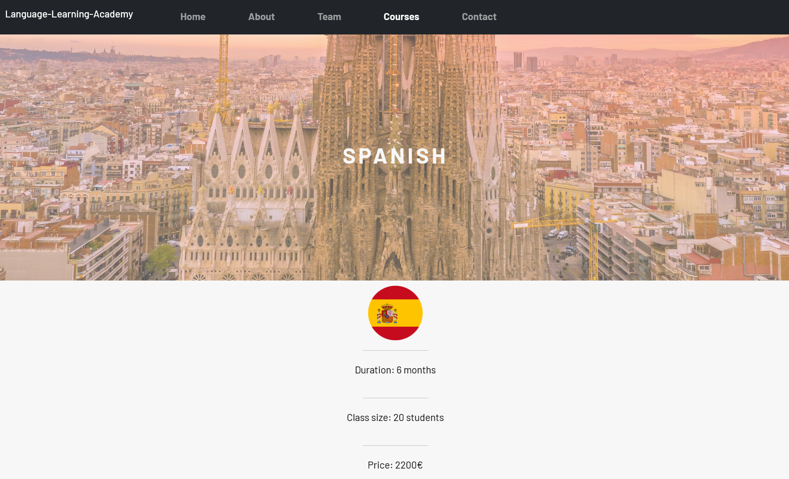

# Language-Learning-Academy

>This README is about the following website: https://stefanamur.github.io/Language-Learning-Academy/

**[Reinout De Bleser](https://github.com/RedMarkD) made this readme**   
***Later edited by [Stefan Amuraritei](https://github.com/StefanAmur)***   

>We promise the readme is fun to read. We have a coding joke at the end. 
>
>We simply made the README to explain our project. 

## Project

>Our project is simple, for our course in BeCode we had to make our first business website in a team.      
> We had 4 days to complete it   
> The website is for a school that offers courses on foreign languages  

## Learning objectives
- ✔learn to work in a group  
- ✔learn to complete a project so it can be delivered to a client

## The mission
- ✔Invent a company together and think of 1 page per person in your team, that the company needs
- ✔Divide those pages amongst the group and each person designs one page.
- ✔Once you are all finished, join those pages together with some form of navigation
- ✔Publish the result with a github repository (call it name-of-your-business)
- ✔Make sure everyone in the group has a fork of the website
- ✔Explain your company in the readme of the repo and put a link to the company'website' in there
- ✔Add a parallax image header
- ✔Add a carousel on one page
- ✔Make your website responsive
- ✔Mention your phone number somewhere on the onepager, in the a tag add tel in the href.
- ✔Have a contact form, add a fake email in the mailto property.  

## Who made what...
Since we were 5 in the team and since each of us had to make one page we agreed on the following:  
Note: the names are links to the respective GitHub profiles
 
- Landing page -> by [Neha Honrao](https://github.com/nehahonrao)  
- About us page -> by [Reinout De Bleser](https://github.com/RedMarkD) 
- Team page -> by [Xiaqi Li](https://github.com/830503)   
- Courses page -> by me, [Stefan Amuraritei](https://github.com/StefanAmur)    
- Contact page -> by [Binayak](https://github.com/itsme17)   

## The repo on GitHub contains: 

>-img folder  
>-styles folder  
>-pages folder  
>index.html  
>FFA-Checklist.txt  
>Preview.png  
>styles.css  

Purpose of FFA-checklist: mainly to review progress and divide tasks. 

>Our teammembers consist of: 
>Stefan, 
>Neha, 
>Xiaoqi, 
>Binayak 
>and Reinout

## Preview:

                        .="=.
                      _/.-.-.\_     _
                     ( ( o o ) )    ))
                      |/  "  \|    //
      .-------.        \'---'/    //
     _|~~ ~~  |_       /`"""`\\  ((
    =(_|_______|_)=    / /_,_\ \\  \\
    |:::::::::|      \_\\_'__/ \  ))
    |:::::::[]|       /`  /`~\  |//
    |o=======.|      /   /    \  / 
    `"""""""""`  ,--`,--'\/\    /
                 '-- "--'  '--'

>The readme is **fun** to read! 

>The readme looks **good**!

The readme is clear even though the monkey has no idea what is going on.

>### Joke:
>How many programmers does it take to change a light bulb?
>None – It’s a hardware problem
